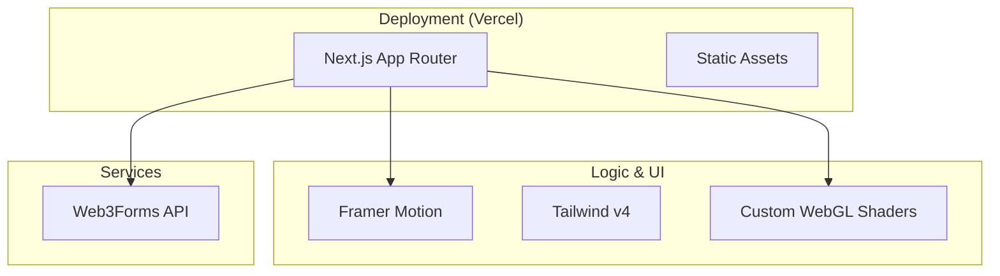

# Shemayon Soloman Portfolio

Modern, high-performance portfolio platform built for machine intelligence and digital architecture. Featuring a dark-only HUD aesthetic, serverless infrastructure, and ATS-optimized data systems.

[](https://choosealicense.com/licenses/mit/)
[](https://www.typescriptlang.org/)
[](https://react.dev)
[](https://nextjs.org/)
[](https://tailwindcss.com/)

---

## 🚀 Vision

I build multi-agent systems and perception engines that bridge the physical and digital worlds. This platform is a testament to that mission—leveraging serverless technologies and modern web standards to deliver a high-fidelity experience without the overhead of traditional backend infrastructure.

## ✨ Core Features

- **Synthetix Pro UI**: A premium HUD-inspired design system utilizing glassmorphism, neural-glow backgrounds, and fluid Framer Motion animations.
- **Serverless Contact Engine**: Zero-server handling of inquiries via Web3Forms, ensuring privacy and reliability.
- **Interactive Social Hub**: Real-time modal popups for contact numbers with one-tap clipboard synchronization.
- **Digital Identity**: Strictly typed profile management system serving as a single source of truth for the portfolio and CV.
- **Static Mastery**: Fully optimized for static export (`output: 'export'`), ensuring sub-second load times and global scalability.

## 🛠️ Technical Architecture



## 📂 Project Structure

```bash
shemayon-portfolio/
├── public/                # Static assets & headshots
├── src/
│   ├── app/               # Next.js 16 App Router (Routes & Layouts)
│   ├── components/        # React components (HUD Elements, HUD Sections)
│   ├── data/              # Domain-specific data (Projects, Skills, Education)
│   ├── hooks/             # Custom React lifecycle hooks
│   ├── lib/               # Foundational profiling & utilities
│   └── types/             # Strict TypeScript definitions
├── next.config.mjs        # Performance & export configuration
└── package.json           # Dependencies & build scripts
```

## 🏗️ Getting Started

### Prerequisites

- **Node.js**: >= 24.0.0
- **pnpm**: Recommended package manager

### Installation

```bash
# Clone the repository
git clone https://github.com/shemayon/shemayon-portfolio.git
cd shemayon-portfolio

# Install dependencies
pnpm install

# Environment Setup
cp .env.example .env.local
# Set NEXT_PUBLIC_WEB3FORMS_KEY in .env.local
```

### Development Commands

```bash
pnpm dev          # Start local development server
pnpm build        # Build application (generates image variants)
pnpm lint         # Run Biome linting & formatting
```

## 👨‍💻 Author

### Shemayon Soloman
**Machine Learning Engineer & Generative AI Systems Developer**

- [GitHub](https://github.com/shemayon)
- [LinkedIn](https://linkedin.com/in/shemayon-soloman)
- [Hugging Face](https://huggingface.co/shemayons)
- [Medium](https://medium.com/@shemayons)

---

Built with ❤️ by Shemayon.
